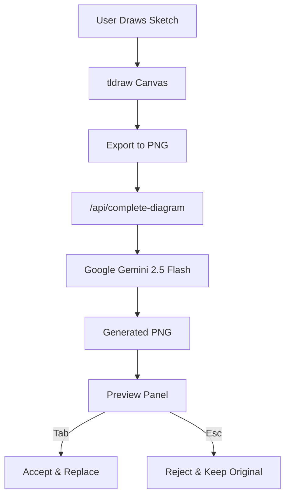

<p align="center">
  
  
  
  
  
</p>

<h1 align="center">🎨 ChalkAI</h1>

<p align="center">
  <strong>Transform rough sketches into professional diagrams with AI</strong>
</p>

<p align="center">
  An intelligent whiteboard application that uses Google Gemini to refine hand-drawn sketches into clean, publication-ready diagrams.
</p>

---

## 🎥 Demo


---

## ✨ Features

| Feature | Description |
|---------|-------------|
| 🖌️ **Interactive Whiteboard** | Full-featured drawing canvas powered by tldraw with support for freehand drawing, shapes, arrows, and more |
| 🤖 **AI-Powered Refinement** | Leverages Google Gemini 2.5 Flash to transform rough sketches into professional diagrams |
| 🎤 **Voice Input** | Describe your diagram intent using voice commands with automatic idle detection |
| ⚡ **Quick Enhance** | One-click enhancement to instantly improve any sketch |
| 🎯 **Selection-Aware** | Refine specific parts of your canvas by selecting shapes before generating |
| ⌨️ **Keyboard Shortcuts** | Accept suggestions with `Tab`, reject with `Esc` for rapid iteration |
| 🎨 **Glass Morphism UI** | Modern, sleek interface with smooth animations powered by Framer Motion |

---

## 🚀 Quick Start

### Prerequisites

- **Node.js** 18+ or **Bun** runtime
- **Google Gemini API Key** ([Get one here](https://aistudio.google.com/app/apikey))

### Installation

```bash
# Clone the repository
git clone https://github.com/yourusername/ChalkAI.git
cd ChalkAI/frontend

# Install dependencies
npm install
# or
bun install
```

### Environment Setup

Create a `.env.local` file in the `frontend` directory:

```env
GOOGLE_GENERATIVE_AI_API_KEY=your_api_key_here
```

### Run Development Server

```bash
npm run dev
# or
bun run dev
```

Open [http://localhost:3000](http://localhost:3000) in your browser.

---

## 📖 How to Use

<table>
<tr>
<td width="60">

**1️⃣**

</td>
<td>

**Draw** — Sketch your diagram idea on the whiteboard

</td>
</tr>
<tr>
<td>

**2️⃣**

</td>
<td>

**Describe** — Type or speak what your diagram represents

</td>
</tr>
<tr>
<td>

**3️⃣**

</td>
<td>

**Generate** — Click the `+` button or use the ✨ Quick Enhance

</td>
</tr>
<tr>
<td>

**4️⃣**

</td>
<td>

**Review** — See the AI-generated diagram in the preview panel

</td>
</tr>
<tr>
<td>

**5️⃣**

</td>
<td>

**Accept** — Press `Tab` to replace your sketch with the refined diagram

</td>
</tr>
</table>

### Voice Input 🎤

1. Click the **microphone button** to start listening
2. Describe your diagram verbally
3. Stop speaking for 4.5 seconds or click the mic again
4. The AI automatically generates based on your voice description

---

## 🏗️ Architecture



---

## 📂 Project Structure

```
frontend/
├── app/
│   ├── api/
│   │   └── complete-diagram/
│   │       └── route.ts        # AI processing endpoint
│   ├── page.tsx                # Main application page
│   ├── layout.tsx              # Root layout with metadata
│   └── globals.css             # Global styles & theme
├── components/
│   ├── ui/                     # Reusable UI components
│   │   └── button.tsx          # Button component with variants
│   ├── whiteboard.tsx          # tldraw canvas wrapper
│   └── intent-input.tsx        # Text input for diagram intent
├── lib/
│   └── utils.ts                # Utility functions (cn helper)
└── types/
    └── speech-recognition.d.ts # TypeScript declarations
```

---

## 🛠️ Tech Stack

| Category | Technology |
|----------|------------|
| **Framework** | Next.js 16 (App Router) |
| **UI Library** | React 19 |
| **Language** | TypeScript 5 |
| **Styling** | Tailwind CSS 4 |
| **Animations** | Framer Motion |
| **Whiteboard** | tldraw v4 |
| **AI Integration** | Vercel AI SDK + Google Gemini |
| **Components** | Custom + shadcn/ui patterns |

---

## 🔌 API Reference

### `POST /api/complete-diagram`

Generates a refined diagram from a sketch and text description.

**Request Body:**

```json
{
  "prompt": "A flowchart showing user authentication process",
  "image_data": "base64_encoded_png_data"
}
```

**Response:**

```json
{
  "image_data": "base64_encoded_generated_png"
}
```

**Error Response:**

```json
{
  "error": "Error message",
  "details": "Additional error details"
}
```

---

## ⌨️ Keyboard Shortcuts

| Shortcut | Action |
|----------|--------|
| `Tab` | Accept the AI suggestion |
| `Esc` | Reject the AI suggestion |
| *tldraw shortcuts* | All standard tldraw shortcuts work |

---

## 🧩 Key Components

### `<Whiteboard />`
The core canvas component wrapping tldraw. Handles:
- Canvas mounting and export functionality
- Selection-aware image export
- AI suggestion acceptance (Tab key)
- Drawing activity detection for voice input

### `<IntentInput />`
A minimal text input for describing diagram intent with:
- 120 character limit
- Clean, borderless design
- Submit on Enter

---

## 📦 Scripts

```bash
# Development server with hot reload
npm run dev

# Production build
npm run build

# Start production server
npm run start

# Run ESLint
npm run lint
```

---

## 🔧 Troubleshooting

<details>
<summary><strong>❌ API Key Issues</strong></summary>

- Ensure `.env.local` is in the `frontend` directory
- Restart the dev server after modifying environment variables
- Verify your API key is valid at [Google AI Studio](https://aistudio.google.com/)
</details>

<details>
<summary><strong>❌ LightningCSS Binary Error (Windows)</strong></summary>

If you see an error about `lightningcss.win32-x64-msvc.node`:

```powershell
npm install lightningcss-win32-x64-msvc
Copy-Item "node_modules\lightningcss-win32-x64-msvc\lightningcss.win32-x64-msvc.node" "node_modules\lightningcss\lightningcss.win32-x64-msvc.node"
Remove-Item -Recurse -Force .next
npm run dev
```
</details>

<details>
<summary><strong>❌ No Image Generated</strong></summary>

- Make sure you've drawn something on the canvas
- Check that your Gemini API key has access to image generation models
- Look at browser console and terminal for detailed error messages
</details>

---

## 🤝 Contributing

Contributions are welcome! Please feel free to submit a Pull Request.

---

## 📄 License

MIT License — feel free to use this project for personal or commercial purposes.

---

<p align="center">
  Made with ❤️ using Next.js, tldraw, and Google Gemini
</p>
